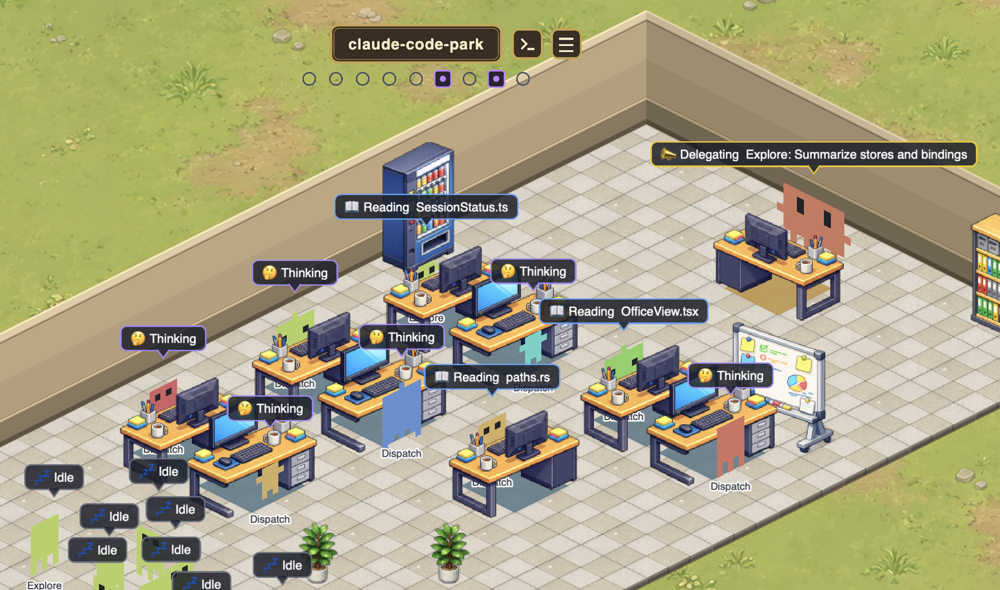
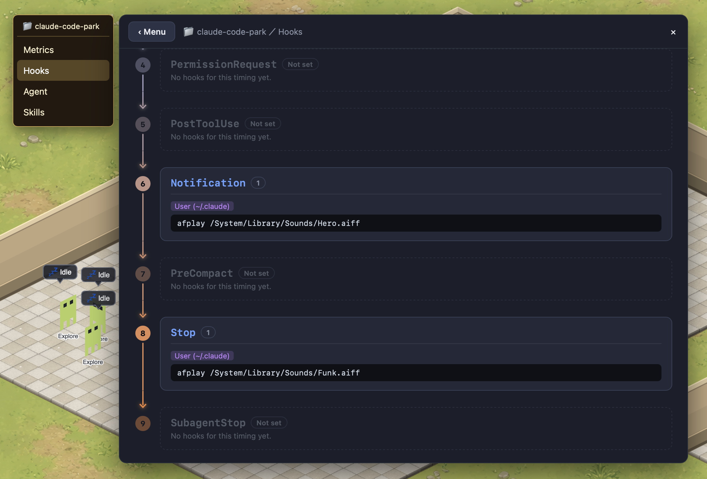
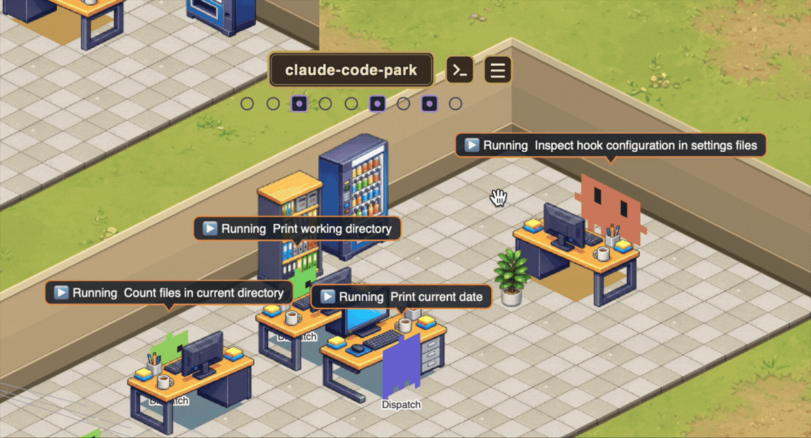
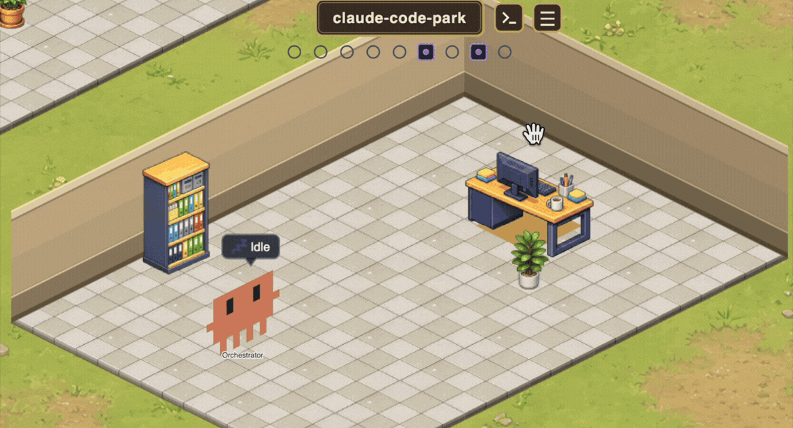
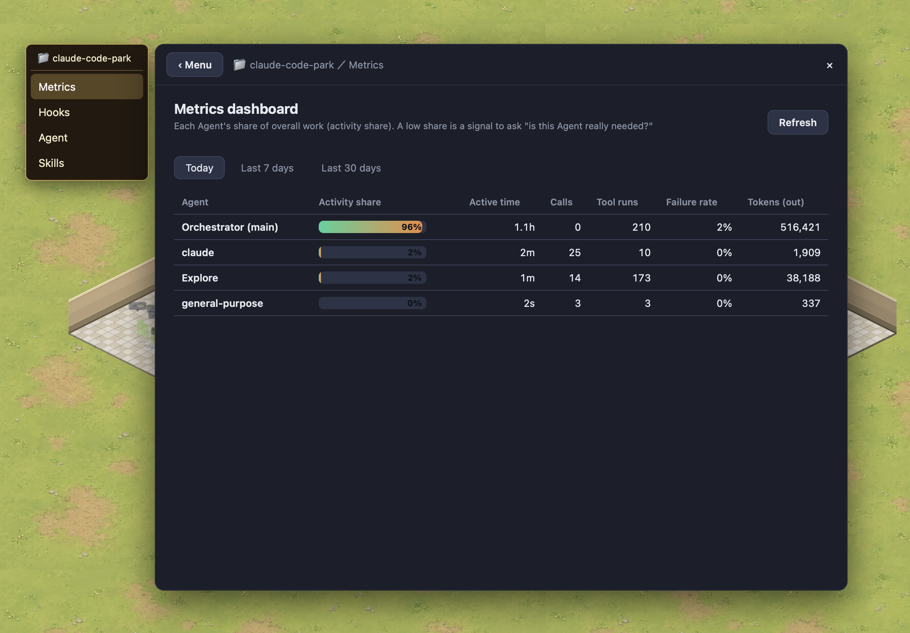

# Claude Code Park

**A desktop app that visualizes Claude Code as a top-down office.**
It treats your local `~/.claude/` as the single source of truth, drawing agents as "employees" and each running session as the "orchestrator" — all animated in real time.



## Why Claude Code Park

Claude Code's Hooks, Skills, and Agents are spread across many config locations, making it hard to answer "**what is this session actually composed of right now?**" Claude Code Park lets you see and understand it at a glance.

- **Visualize hooks per session** — see the hook setup that actually applies to a session (including plugin-provided hooks) in one place.
  
- **Learn when hooks fire** — an animation shows when and which hook ran, so you can grasp the hook lifecycle just by watching real behavior.
  
- **Visualize Skills & Agents** — see which agents and skills are defined, and which ones are currently "at work."
- **Manage multiple sessions on one screen** — run several Claude Code sessions at once and track all of their progress from a single view.
  
- **Jump back to the terminal in one click** — click an employee/session to bring the terminal that launched it (Terminal.app / iTerm2 / VS Code / Ghostty) to the front.
  
- **Management dashboard** — utilization, call count, failure rate, and tokens per agent, aggregated over today / 7d / 30d.
  

## Safe by design

- **No external communication** — reads only your local `~/.claude/`; nothing ever leaves your machine. No telemetry, no accounts, no network calls.
- **Your files stay the source of truth** — Claude Code Park keeps no separate database; it just reflects `~/.claude/` live, so there's no hidden state to trust.
- **Reversible, safe writes** — every config write is backed up first, then written via a temp file + atomic rename, so an edit can't half-write or corrupt your settings.
- **Touches only what it manages** — when editing `settings.json` it replaces only the `hooks` key and leaves everything else (permissions, env, …) untouched.
- **Open source (MIT)** — all of the above is auditable.

## Requirements

- **macOS only** (terminal focusing uses AppleScript / `ps`)
- [Claude Code](https://docs.claude.com/claude-code) installed, with an existing `~/.claude/`

## Install (for users)

1. Download the latest `.dmg` from [Releases](../../releases), open it, and drag Claude Code Park into Applications.
2. The app is unsigned, so on first launch macOS Gatekeeper will warn you. Open it one of these ways:
   - **macOS 14 or earlier**: right-click the app → "Open".
   - **macOS 15 (Sequoia) or later**: System Settings → "Privacy & Security" → "Open Anyway" near the bottom.
   - Or from a terminal:
     ```bash
     xattr -dr com.apple.quarantine "/Applications/Claude Code Park.app"
     ```

## Build from source / Development

Requirements: [Node.js](https://nodejs.org) 18+ / npm, and Rust (stable). Install Rust via [rustup](https://rustup.rs).

> See the [Tauri prerequisites](https://tauri.app/start/prerequisites/) for full setup (Rust, Xcode Command Line Tools, etc.).

```bash
npm install
npm run app      # = tauri dev (launches the desktop window)
```

Other commands:

```bash
npm run build                                   # type-check + build the frontend
npm run tauri build                             # produce a distributable .dmg
cargo test --manifest-path src-tauri/Cargo.toml # Rust tests + regenerate ts-rs bindings
```

The Rust→TS bindings in `src/bindings/*.ts` are regenerated by `cargo test`; do not edit them by hand.

## Tech stack

- Backend: Tauri v2 (Rust) — file watching / JSONL parsing / config read-write / metrics aggregation
- Frontend: React + Vite + Zustand; the top-down office is rendered with Pixi.js

## How it works

It watches the append-only `~/.claude/projects/{proj}/{sessionId}.jsonl` files, parses the deltas, classifies them into work kinds (Reading / Editing / Running / Delegating …), and reflects them in the office. Config writes are done safely via backup → temp file → atomic rename.

## License

[MIT](LICENSE)
